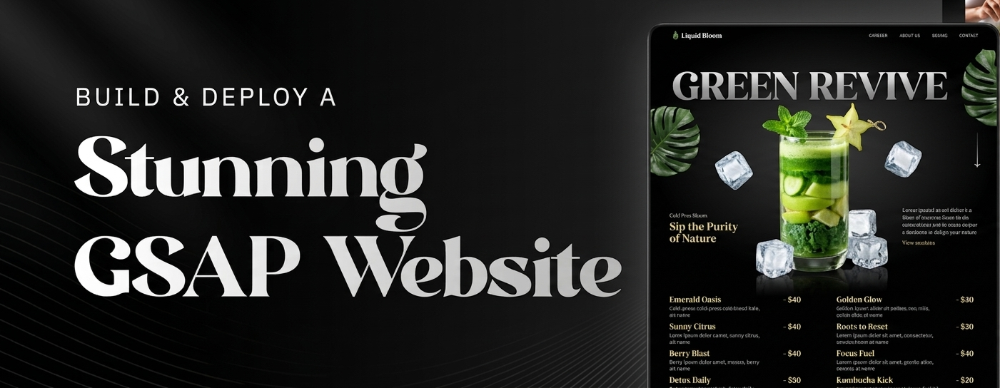
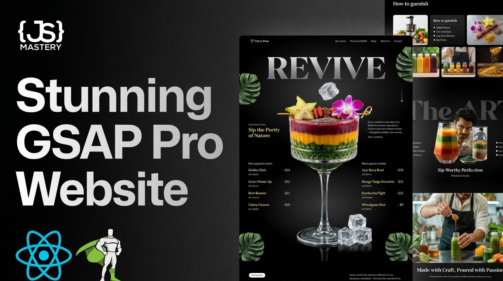
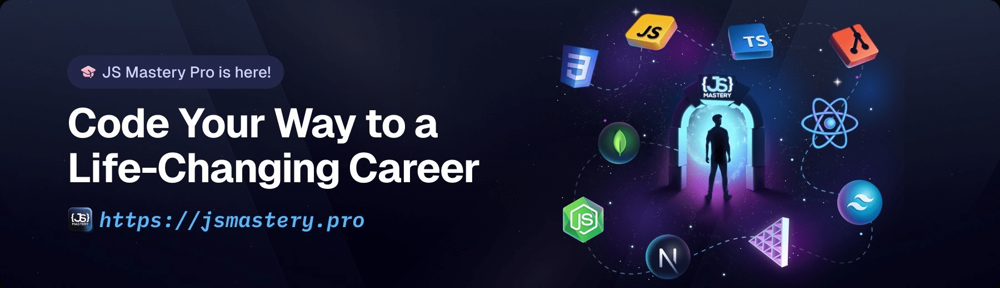

<div align="center">

  

  <br />
  <br />

  <div>
    
    
    
    
    
  </div>

  <h1>🍹 Velvet Pour — Stunning GSAP Website</h1>

  <p>
    A cinematic, animation-rich juicery landing page built with <strong>Next.js 16</strong>, <strong>GSAP 3</strong>, and <strong>React 19</strong>.
    Features scroll-driven video playback, SplitText character animations, parallax leaf effects,
    an interactive drink carousel, and a comprehensive GSAP animation lesson playground.
  </p>

</div>

---

## 📸 Preview

<div align="center">
  
</div>

---

## ✨ Features

- **🎬 Scroll-Driven Video** — Video playback is controlled entirely by ScrollTrigger, syncing each frame to the user's scroll position
- **🔤 SplitText Animations** — Hero title characters animate in with staggered `expo.out` easing, while subtitle lines glide up elegantly
- **🍃 Parallax Leaf Effects** — Decorative tropical leaves move at independent rates across the Hero, Cocktails, and Menu sections
- **📜 Scroll-Pinned Sections** — GSAP ScrollTrigger pins sections and scrubs timelines for a magazine-quality reading experience
- **🎠 Interactive Drink Carousel** — Browse all cocktails with animated slide transitions powered by `gsap.fromTo`
- **🖤 Sticky Frosted Navbar** — Navbar transitions from transparent to a blurred dark glass background on scroll
- **📐 Responsive Animations** — `gsap.matchMedia()` adapts every animation for mobile, tablet, and desktop viewports
- **📚 GSAP Lesson Playground** — A dedicated `/lesson` route with 7 interactive mini-lessons covering every core GSAP API

---

## 🗂️ Project Structure

```
next_gsap/
├── public/
│   ├── images/          # All app imagery (drinks, leaves, profiles, icons)
│   ├── videos/          # output.mp4 for scroll-driven playback
│   ├── fonts/           # Custom font files
│   └── readme/          # Assets used in this README
├── src/
│   ├── app/
│   │   ├── layout.tsx   # Root layout with font variables & GsapSetup wrapper
│   │   ├── page.tsx     # Landing page (Navbar → Hero → Cocktails → About → Art → Menu → Contact)
│   │   ├── globals-land.css   # Landing page styles
│   │   ├── globals-lesson.css # Lesson page styles
│   │   └── lesson/      # GSAP lesson playground
│   │       ├── page.tsx         # Lesson index listing all 7 animations
│   │       ├── gsapTo/
│   │       ├── gsapFrom/
│   │       ├── gsapFromTo/
│   │       ├── gsapTimeline/
│   │       ├── gsapStagger/
│   │       ├── gsapScrollTrigger/
│   │       └── gsapText/
│   ├── components/
│   │   ├── Navbar.tsx      # Sticky frosted-glass navbar with scroll animation
│   │   ├── Hero.tsx        # SplitText title + scroll-driven video pinning
│   │   ├── Cocktails.tsx   # Parallax cocktail & mocktail menu list
│   │   ├── About.tsx       # Responsive image grid with matchMedia animations
│   │   ├── Art.tsx         # Artistic section with GSAP-driven reveals
│   │   ├── Menu.tsx        # Interactive drink carousel with GSAP transitions
│   │   └── Contact.tsx     # Contact section with social links
│   ├── constants/
│   │   └── index.ts        # Nav links, cocktail data, store info, socials
│   └── shared/
│       └── GsapSetup.tsx   # Global GSAP plugin registration (ScrollTrigger, SplitText)
```

---

## 🛠️ Tech Stack

| Technology                                                       | Version   | Purpose                                   |
| ---------------------------------------------------------------- | --------- | ----------------------------------------- |
| [Next.js](https://nextjs.org)                                    | `16.3.5`  | React framework with App Router           |
| [React](https://react.dev)                                       | `19.2.8`  | UI library                                |
| [GSAP](https://gsap.com)                                         | `^3.15.0` | Animation engine                          |
| [@gsap/react](https://gsap.com/resources/React/)                 | `^2.1.2`  | `useGSAP` hook for React                  |
| [Tailwind CSS](https://tailwindcss.com)                          | `^4`      | Utility-first CSS framework               |
| [TypeScript](https://www.typescriptlang.org)                     | `^5`      | Static type checking                      |
| [react-responsive](https://github.com/yocontra/react-responsive) | `^10.0.1` | Media query hooks for adaptive animations |

---

## 🚀 Getting Started

### Prerequisites

- **Node.js** `18+`
- **pnpm** `11.17.0+` — install via `npm install -g pnpm`

### Installation

```bash
# 1. Clone the repository
git clone https://github.com/your-username/next_gsap.git
cd next_gsap

# 2. Install dependencies
pnpm install

# 3. Start the development server
pnpm dev
```

Open [http://localhost:3000](http://localhost:3000) to view the landing page.
Open [http://localhost:3000/lesson](http://localhost:3000/lesson) to explore the GSAP playground.

### Available Scripts

| Command      | Description                  |
| ------------ | ---------------------------- |
| `pnpm dev`   | Start the development server |
| `pnpm build` | Create a production build    |
| `pnpm start` | Run the production server    |
| `pnpm lint`  | Run ESLint                   |

---

## 🎓 GSAP Lesson Playground

Navigate to `/lesson` to access hands-on demonstrations of every core GSAP concept:

| #   | Lesson                 | Description                                                       |
| --- | ---------------------- | ----------------------------------------------------------------- |
| 1   | **GSAP To**            | Animate elements from their current state to a target state       |
| 2   | **GSAP From**          | Animate elements backward from a defined endpoint                 |
| 3   | **GSAP FromTo**        | Define both start and end states explicitly                       |
| 4   | **GSAP Timeline**      | Sequence multiple animations with precise timing control          |
| 5   | **GSAP Stagger**       | Apply staggered delays across multiple targets                    |
| 6   | **GSAP ScrollTrigger** | Trigger and scrub animations based on scroll position             |
| 7   | **GSAP Text**          | Animate text with SplitText for character/word/line-level control |

---

## 🏗️ Key Animation Patterns

### Scroll-Driven Video Playback

```tsx
// Hero.tsx — video currentTime is driven entirely by scroll position
gsap
  .timeline({
    scrollTrigger: {
      trigger: video,
      start: "center 60%",
      end: "bottom top",
      scrub: 1,
      pin: true,
    },
  })
  .to(video, { currentTime: video.duration, ease: "none" });
```

### SplitText Character Animation

```tsx
// Hero.tsx — each character slides up with stagger
const heroSplit = new SplitText(".title", { type: "chars, words" });
gsap.from(heroSplit.chars, {
  yPercent: 100,
  duration: 1.8,
  stagger: 0.06,
  ease: "expo.out",
});
```

### Responsive Animations with matchMedia

```tsx
// About.tsx — different timelines for mobile, tablet, desktop
const mm = gsap.matchMedia();
mm.add("(min-width: 1024px)", () => {
  /* desktop image grid choreography */
});
mm.add("(max-width: 767px)", () => {
  /* mobile stagger with rotation */
});
```

---

## 🌐 Deployment

Deploy instantly on [Vercel](https://vercel.com), the platform built for Next.js:

```bash
# Install the Vercel CLI
pnpm add -g vercel

# Deploy
vercel
```

Refer to the [Next.js deployment documentation](https://nextjs.org/docs/app/building-your-application/deploying) for full details.

---

## 📄 License

This project is for educational purposes. Built as part of the [JS Mastery](https://jsmastery.pro) curriculum.

<div align="center">
  <br />
  <a href="https://jsmastery.pro">
    
  </a>
</div>
